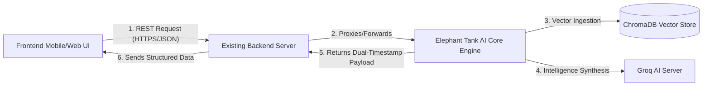

# Elephant Tank AI: Enterprise API & Cross-Device Integration Handbook

This handbook is designed as the single source of truth for **Frontend (UI/UX)** and **Backend Integration** developers working across different machines and environments. It details the system architecture, cross-device hosting strategies, and provides the complete REST API catalog with precise JSON request/response formats.

---

## Part 1: High-Level Integration Architecture (Simplest Terms)

To integrate this AI core system with your existing web or mobile app, the teams will treat your module as an **independent, specialized microservice**.



### Roles of Each Dev Team:
1. **Frontend Dev (UI/UX):**
   - Designs interactive forms, dropzones for PDF pitch decks, and visual charts (e.g., radar charts for scores, timelines for historical evaluations, and node graphs for ecosystem mappings).
   - Directly calls the backend gateway endpoints to retrieve structured, formatted data.
2. **Backend Dev (Integration & Gateway):**
   - Hosts your Elephant Tank AI service on an accessible server (or tunnels it during development).
   - Creates endpoint gateways that call this module, caches responses, and securely manages API keys (Groq/ChromaDB).

---

## Part 2: Multi-Device & Cross-Machine Hosting

Since your developers are on different machines/devices, they cannot use `localhost` directly. Choose one of the following strategies:

### 1. The Development Setup (Quickest Tunneling)
To share your local running Elephant Tank AI instance with a frontend dev on another machine instantly:
1. Run Uvicorn locally:
   ```bash
   venv\Scripts\python -m uvicorn app.api.main:app --host 0.0.0.0 --port 8090
   ```
2. Install and run **Ngrok** (or similar tunneling tool) on your machine:
   ```bash
   ngrok http 8090
   ```
3. Share the secure public URL generated by Ngrok (e.g., `https://xxxx.ngrok-free.app`) with the frontend and backend developers. They can use this public URL directly in their apps.

### 2. The Production Setup (Enterprise Cloud)
- **Deployment:** Deploy the FastAPI code using a Docker container (a `Dockerfile` wrapping Python 3.12) to AWS ECS, Google Cloud Run, or DigitalOcean.
- **CORS Configuration:** Ensure `app/api/main.py` has middleware configuring allowed origins to match the production frontend domain:
  ```python
  from fastapi.middleware.cors import CORSMiddleware
  
  app.add_middleware(
      CORSMiddleware,
      allow_origins=["https://your-frontend-app.com"],
      allow_credentials=True,
      allow_methods=["*"],
      allow_headers=["*"],
  )
  ```

---

## Part 3: Complete REST API Endpoints Catalog

Every execution log returned by these endpoints includes our **real-time dynamic dual-timestamp schema**:
```json
{
  "stage": "STARTUP_EVALUATION",
  "status": "SUCCESS",
  "message": "Detailed stage description.",
  "timestamp_unix": 1779796514,
  "timestamp_readable": "2026-05-26T15:25:14+05:30"
}
```

---

### Category A: Ingestion & Venture Evaluation

#### 1. Document Intelligence Ingestion (`POST /upload-startup-documents`)
* **Purpose:** Accepts PDF pitch decks, resumes, or financial spreadsheets. Extracts unstructured text, dynamically routes it, and outputs a complete Pydantic-compliant structured startup evaluation.
* **Content-Type:** `multipart/form-data`
* **Request Payload:**
  - `file`: Binary file (PDF, PPTX, or TXT)
* **Response Payload (`200 OK`):**
  ```json
  {
    "pipeline_id": "eval_8f7b2c9a",
    "startup_profile": {
      "startup_name": "MediVision AI",
      "target_stage": "Series A"
    },
    "evaluation_results": {
      "innovation_score": 8,
      "market_score": 9,
      "scalability_score": 8,
      "founder_score": 9,
      "funding_readiness_score": 8,
      "overall_score": 84
    },
    "reasoning_traces": {
      "innovation_reasoning": [
        "Multimodal medical imaging intelligence integrating directly into hospital PACS systems."
      ],
      "market_reasoning": [
        "Fast-growing PACS AI diagnostic market with pilot traction in 12 active medical centers."
      ],
      "scalability_reasoning": [
        "Highly repeatable B2B SaaS deployment pipeline."
      ],
      "founder_reasoning": [
        "Founder holds 8+ years experience in medical imaging machine learning."
      ]
    },
    "founder_intelligence": {
      "strengths": ["Deep domain ML expertise", "Active clinical pilots established"],
      "weaknesses": ["Lacks corporate scale-up B2B sales execution history"]
    },
    "risk_analysis": {
      "risks": ["Saturated imaging SaaS landscape", "Regulatory FDA/CE compliance lag"]
    },
    "recommendations": [
      "Accelerate institutional business development hires.",
      "Pursue formal clinical FDA clearance timelines."
    ],
    "due_diligence_questions": [
      "What is the average customer acquisition cost (CAC) for active hospital channels?"
    ],
    "confidence_summary": {
      "overall_confidence": 9
    },
    "execution_logs": [
      {
        "stage": "STARTUP_EVALUATION",
        "status": "SUCCESS",
        "message": "Qualitative reasoning generated by Groq. Deterministic scoring and confidence calculated locally.",
        "timestamp_unix": 1779836712,
        "timestamp_readable": "2026-05-27T09:45:12+05:30"
      }
    ]
  }
  ```
* **UI/UX Recommendation:** Create a file drag-and-drop zone with a loading spinner. Upon successful response, render score metrics in a Radar Chart and strengths/weaknesses in color-coded cards.

---

#### 2. Quantitative Venture Evaluation (`POST /evaluate-startup`)
* **Purpose:** Evaluates raw text pitch data or manual input descriptions directly without file uploads.
* **Content-Type:** `application/json`
* **Request Payload:**
  ```json
  {
    "startup_name": "Quantum Secure",
    "target_stage": "Pre-seed",
    "startup_description": "Post-quantum cryptographic key distribution protocols for commercial banking sectors.",
    "founder_data": "Dr. Sarah Lin, PhD in Cryptography from ETH Zurich, 12 years research lead."
  }
  ```
* **Response Payload (`200 OK`):**
  *(Matches the Pydantic structured output of `/upload-startup-documents` above).*

---

### Category B: Semantic Vector Intelligence & Matchmaking

#### 1. Startup Semantic Similarity (`POST /similarity`)
* **Purpose:** Searches the vector store for competitors and identifies market sector clusters using pairwise cosine matching.
* **Content-Type:** `application/json`
* **Request Payload:**
  ```json
  {
    "startup_description": "Enterprise AI PACS medical imaging tools.",
    "limit": 3
  }
  ```
* **Response Payload (`200 OK`):**
  ```json
  {
    "similar_startups": [
      {
        "startup_name": "MediVision AI",
        "similarity_score": 0.942,
        "target_stage": "Series A"
      }
    ],
    "related_market_categories": ["Medical Diagnostics", "B2B SaaS"],
    "overlapping_business_models": ["Subscription SaaS"],
    "ecosystem_patterns": ["High regulatory barriers, PACS vendor lock-in"],
    "execution_logs": [
      {
        "stage": "SEMANTIC_SIMILARITY",
        "status": "SUCCESS",
        "message": "Successfully calculated cosine similarity across startups index in 0.015s.",
        "timestamp_unix": 1779836720,
        "timestamp_readable": "2026-05-27T09:45:20+05:30"
      }
    ]
  }
  ```

---

#### 2. Institutional Investor Matchmaking (`POST /match-investors`)
* **Purpose:** Matches a startup semantically to indexed Venture Capital profiles, calculating an alignment score.
* **Content-Type:** `application/json`
* **Request Payload:**
  ```json
  {
    "target_stage": "Seed",
    "startup_description": "Generative AI code validation systems.",
    "limit": 2
  }
  ```
* **Response Payload (`200 OK`):**
  ```json
  {
    "matches": [
      {
        "investor_name": "Apex Venture Partners",
        "fit_rating": 89,
        "investment_thesis_alignment": "Strong focus on early-stage developer tools and B2B SaaS architecture.",
        "match_reasoning": "Fits Apex's sweet spot ($1M-$3M ticket sizes, developer focus)."
      }
    ],
    "execution_logs": [
      {
        "stage": "INVESTOR_MATCHING",
        "status": "SUCCESS",
        "message": "Retrieved top 1 investor matches from active vector database index.",
        "timestamp_unix": 1779836725,
        "timestamp_readable": "2026-05-27T09:45:25+05:30"
      }
    ]
  }
  ```
* **UI/UX Recommendation:** Render matches in a list with an interactive Match Score percentage dial (e.g., Circular progress bar colored from Red -> Yellow -> Green).

---

### Category C: Strategic Simulation & Forecasting

#### 1. Strategic Macro/Ecosystem Shock Simulation (`POST /simulation/shock`)
* **Purpose:** Simulates how macro market forces (e.g., inflation spikes, regulatory lockdowns, hardware supply shortages) impact a startup's viability.
* **Content-Type:** `application/json`
* **Request Payload:**
  ```json
  {
    "startup_name": "MediVision AI",
    "shock_type": "REGULATORY_CRACKDOWN"
  }
  ```
* **Response Payload (`200 OK`):**
  ```json
  {
    "status": "SUCCESS",
    "shock_simulated": "REGULATORY_CRACKDOWN",
    "original_score": 84,
    "adjusted_score": 67,
    "impact_severity": "HIGH",
    "reasoning": "Increased FDA audit scopes delay customer acquisition timelines by 12-18 months, reducing immediate B2B SaaS revenue runs.",
    "mitigation_strategies": [
      "Hire dedicated healthcare compliance counsel immediately.",
      "Buffer operational cash reserves by an additional 6 months."
    ]
  }
  ```
* **UI/UX Recommendation:** Create a **"What-If Simulation Dashboard"** where the user can trigger shocks from a dropdown and see a side-by-side comparison of "Before" vs "After" scores.

---

### Category D: Strategic Exports

#### 1. Generate Master Report & PDF Export (`POST /reports/generate-master`)
* **Purpose:** Triggers advanced long-context PE/VC memo generation, returning download links for JSON, Markdown, and print-ready PDF reports.
* **Content-Type:** `application/json`
* **Request Payload:**
  ```json
  {
    "startup_name": "MediVision AI",
    "target_stage": "Series A"
  }
  ```
* **Response Payload (`200 OK`):**
  ```json
  {
    "status": "SUCCESS",
    "startup_name": "MediVision AI",
    "overall_score": 84,
    "pdf_report_url": "http://localhost:8090/reports/download/medivision_ai_master_report.pdf",
    "markdown_report_url": "http://localhost:8090/reports/download/medivision_ai_master_report.md",
    "execution_logs": [
      {
        "stage": "REPORT_GENERATION",
        "status": "SUCCESS",
        "message": "Successfully compiled master strategic venture intelligence report in 1.450s.",
        "timestamp_unix": 1779836750,
        "timestamp_readable": "2026-05-27T09:45:50+05:30"
      }
    ]
  }
  ```

---

## Part 4: Developer Integration Checklist

### For Backend Dev (API Gatekeeper):
- [ ] Configure FastAPI CORS middleware with the production domain.
- [ ] Set `GROQ_API_KEY` env variable on the hosting instance.
- [ ] Set up a volume mount or folder directory for local database storage (`uploads/` and `chroma_db_store/`).
- [ ] Implement a proxy or API gateway to forward mobile/web requests to the Elephant Tank AI container.

### For Frontend Dev (UI/UX Designer):
- [ ] Use standard file dropzone widgets for PDF uploads.
- [ ] Map evaluation results to visual data visualization elements (charts, gauges).
- [ ] Formulate clear error-handling tooltips if Uvicorn returns a `500` (e.g., alerting when API keys fail or limits are hit).
- [ ] Maintain the dynamic `pipeline_id` returned on first submission to query subsequent matching (`/similarity`) and simulation (`/simulation/shock`) endpoints.
